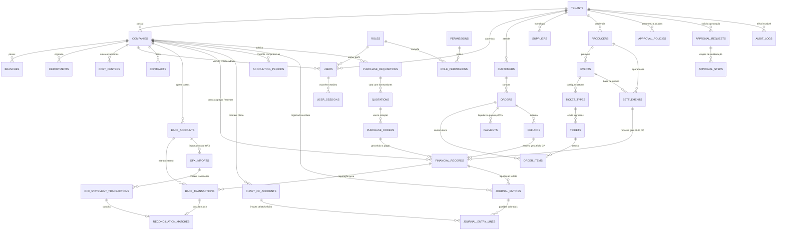

# SEEK DATABASE MASTER v1.0
**Especificação Técnica Canônica do Modelo de Dados Relacional**  
**Versão:** 1.0  
**Data:** 06/10/2026  
**Ambiente Oficial de Produção:** https://seek-xi.vercel.app  
**Motores Suportados:** PostgreSQL 16+ (Produção) / SQLite 3.40+ WAL (Desenvolvimento / Testes Rápidos)

---

## 1. Princípios de Engenharia de Dados & Convenções Globais

### 1.1 Convenção de Nomenclatura
- **Tabelas:** Substantivo plural em `snake_case` (ex: `tenants`, `companies`, `financial_records`, `tickets`).
- **Colunas:** Nomes semânticos em `snake_case` (ex: `payment_method`, `due_date`, `current_balance`).
- **Chaves Primárias (PK):** Coluna `id` do tipo `UUID` (PostgreSQL `gen_random_uuid()` ou UUIDv7). Em SQLite WAL, `TEXT` armazenando strings UUID ou IDs semânticos canônicos.
- **Chaves Estrangeiras (FK):** Sufixo `_id` apontando para a PK da tabela referenciada (ex: `tenant_id`, `company_id`, `supplier_id`).
- **Valores Monetários & Quantitativos:**
  - Valores monetários: `NUMERIC(15, 2)` (estritamente vedado o uso de `FLOAT` ou `REAL` para cálculos contábeis e financeiros em produção).
  - Índices / Percentuais: `NUMERIC(5, 4)` ou `NUMERIC(5, 2)`.
  - Saldos acumulados: `NUMERIC(18, 2)`.
- **Datas & Horários:**
  - `TIMESTAMPTZ` (UTC) para carimbos de evento (`created_at`, `updated_at`, `paid_at`).
  - `DATE` (YYYY-MM-DD) para datas de competência contábil e vencimento (`due_date`, `payment_date`).
- **Booleans:** `BOOLEAN` no PostgreSQL (`TRUE`/`FALSE`) e `INTEGER` no SQLite (`1`/`0`).

### 1.2 Padrão de Multi-Tenancy & Isolamento Rigoroso
- **Tenant Scope:** Todas as tabelas operacionais, analíticas e de configuração possuem a coluna:
  ```sql
  tenant_id UUID NOT NULL REFERENCES tenants(id) ON DELETE RESTRICT
  ```
- **Company Scope:** Tabelas transacionais (financeiro, fiscal, contábil, compras, estoque) possuem adicionalmente:
  ```sql
  company_id UUID NOT NULL REFERENCES companies(id) ON DELETE RESTRICT
  ```
- **Row-Level Security (PostgreSQL RLS):**
  ```sql
  ALTER TABLE financial_records ENABLE ROW LEVEL SECURITY;
  CREATE POLICY tenant_isolation_policy ON financial_records
    USING (tenant_id = NULLIF(current_setting('app.current_tenant_id', true), '')::uuid);
  ```
- **Restrição de Deleção:** Chaves estrangeiras financeiras, contábeis e operacionais usam estritamente `ON DELETE RESTRICT` para evitar exclusões acidentais em cascata e preservar a integridade referencial legal.

### 1.3 Campos de Auditoria Universal & Soft Delete
Toda entidade de negócio inclui:
```sql
created_at TIMESTAMPTZ NOT NULL DEFAULT CURRENT_TIMESTAMP,
updated_at TIMESTAMPTZ NOT NULL DEFAULT CURRENT_TIMESTAMP,
created_by UUID REFERENCES users(id),
updated_by UUID REFERENCES users(id),
deleted_at TIMESTAMPTZ NULL,  -- Soft delete corporativo
version    INTEGER NOT NULL DEFAULT 1  -- Optimistic Locking
```

---

## 2. Diagrama Entidade-Relacionamento Global (ERD)



---

## 3. Especificação Canônica de Tabelas

---

### MÓDULO 1: Core, Multi-Tenant & Identidade

#### 3.1.1 `tenants`
Armazena a instância raiz de cada cliente contratante da plataforma SEEK.
```sql
CREATE TABLE tenants (
    id                  UUID PRIMARY KEY DEFAULT gen_random_uuid(),
    slug                VARCHAR(64) NOT NULL UNIQUE,
    trade_name          VARCHAR(255) NOT NULL,
    legal_name          VARCHAR(255) NOT NULL,
    document_cnpj       VARCHAR(18) NOT NULL UNIQUE,
    status              VARCHAR(32) NOT NULL DEFAULT 'ACTIVE', -- ACTIVE, SUSPENDED, PROVISIONING
    plan_tier           VARCHAR(32) NOT NULL DEFAULT 'ENTERPRISE', -- BASIC, PRO, ENTERPRISE, PLATFORM
    settings_json       JSONB NOT NULL DEFAULT '{}'::jsonb,
    created_at          TIMESTAMPTZ NOT NULL DEFAULT CURRENT_TIMESTAMP,
    updated_at          TIMESTAMPTZ NOT NULL DEFAULT CURRENT_TIMESTAMP,
    deleted_at          TIMESTAMPTZ NULL
);
CREATE INDEX ix_tenants_status ON tenants(status);
```

#### 3.1.2 `companies`
Holding, matrizes e subsidiárias operadas dentro do tenant.
```sql
CREATE TABLE companies (
    id                  UUID PRIMARY KEY DEFAULT gen_random_uuid(),
    tenant_id           UUID NOT NULL REFERENCES tenants(id) ON DELETE RESTRICT,
    parent_company_id   UUID NULL REFERENCES companies(id) ON DELETE RESTRICT,
    code                VARCHAR(32) NOT NULL,
    legal_name          VARCHAR(255) NOT NULL,
    trade_name          VARCHAR(255) NOT NULL,
    document_cnpj       VARCHAR(18) NOT NULL,
    state_registration  VARCHAR(32) NULL,
    tax_regime          VARCHAR(64) NOT NULL DEFAULT 'LUCRO_REAL', -- SIMPLES, LUCRO_PRESUMIDO, LUCRO_REAL
    is_holding          BOOLEAN NOT NULL DEFAULT FALSE,
    currency            VARCHAR(3) NOT NULL DEFAULT 'BRL',
    created_at          TIMESTAMPTZ NOT NULL DEFAULT CURRENT_TIMESTAMP,
    updated_at          TIMESTAMPTZ NOT NULL DEFAULT CURRENT_TIMESTAMP,
    deleted_at          TIMESTAMPTZ NULL,
    UNIQUE(tenant_id, code),
    UNIQUE(tenant_id, document_cnpj)
);
CREATE INDEX ix_companies_tenant ON companies(tenant_id);
```

#### 3.1.3 `branches`
Filiais operacionais e centros de distribuição vinculados a cada empresa.
```sql
CREATE TABLE branches (
    id                  UUID PRIMARY KEY DEFAULT gen_random_uuid(),
    tenant_id           UUID NOT NULL REFERENCES tenants(id) ON DELETE RESTRICT,
    company_id          UUID NOT NULL REFERENCES companies(id) ON DELETE RESTRICT,
    code                VARCHAR(32) NOT NULL,
    name                VARCHAR(255) NOT NULL,
    cnpj_branch         VARCHAR(18) NOT NULL,
    state               VARCHAR(2) NOT NULL,
    city                VARCHAR(128) NOT NULL,
    address_json        JSONB NOT NULL DEFAULT '{}'::jsonb,
    is_active           BOOLEAN NOT NULL DEFAULT TRUE,
    created_at          TIMESTAMPTZ NOT NULL DEFAULT CURRENT_TIMESTAMP,
    updated_at          TIMESTAMPTZ NOT NULL DEFAULT CURRENT_TIMESTAMP,
    deleted_at          TIMESTAMPTZ NULL,
    UNIQUE(company_id, code)
);
CREATE INDEX ix_branches_tenant_comp ON branches(tenant_id, company_id);
```

#### 3.1.4 `departments`
Estrutura departamental interna para custeio, workflow e governança.
```sql
CREATE TABLE departments (
    id                  UUID PRIMARY KEY DEFAULT gen_random_uuid(),
    tenant_id           UUID NOT NULL REFERENCES tenants(id) ON DELETE RESTRICT,
    company_id          UUID NOT NULL REFERENCES companies(id) ON DELETE RESTRICT,
    code                VARCHAR(32) NOT NULL,
    name                VARCHAR(128) NOT NULL,
    manager_user_id     UUID NULL,
    monthly_budget_cap  NUMERIC(15, 2) NOT NULL DEFAULT 0.00,
    created_at          TIMESTAMPTZ NOT NULL DEFAULT CURRENT_TIMESTAMP,
    updated_at          TIMESTAMPTZ NOT NULL DEFAULT CURRENT_TIMESTAMP,
    UNIQUE(company_id, code)
);
```

#### 3.1.5 `cost_centers`
Centros de Custo para apropriação orçamentária, DRE e Contabilidade Gerencial.
```sql
CREATE TABLE cost_centers (
    id                  UUID PRIMARY KEY DEFAULT gen_random_uuid(),
    tenant_id           UUID NOT NULL REFERENCES tenants(id) ON DELETE RESTRICT,
    company_id          UUID NOT NULL REFERENCES companies(id) ON DELETE RESTRICT,
    code                VARCHAR(32) NOT NULL,
    name                VARCHAR(128) NOT NULL,
    monthly_budget      NUMERIC(15, 2) NOT NULL DEFAULT 0.00,
    alert_threshold_pct INTEGER NOT NULL DEFAULT 85,
    is_active           BOOLEAN NOT NULL DEFAULT TRUE,
    created_at          TIMESTAMPTZ NOT NULL DEFAULT CURRENT_TIMESTAMP,
    updated_at          TIMESTAMPTZ NOT NULL DEFAULT CURRENT_TIMESTAMP,
    UNIQUE(company_id, code)
);
CREATE INDEX ix_cost_centers_lookup ON cost_centers(tenant_id, company_id, code);
```

#### 3.1.6 `users`
Contas de usuários corporativos, perfis, alçadas e segurança avançada.
```sql
CREATE TABLE users (
    id                      UUID PRIMARY KEY DEFAULT gen_random_uuid(),
    tenant_id               UUID NOT NULL REFERENCES tenants(id) ON DELETE RESTRICT,
    company_id              UUID NOT NULL REFERENCES companies(id) ON DELETE RESTRICT,
    branch_id               UUID NULL REFERENCES branches(id) ON DELETE SET NULL,
    role_id                 UUID NOT NULL, -- FK roles
    full_name               VARCHAR(255) NOT NULL,
    email                   VARCHAR(255) NOT NULL,
    password_hash           VARCHAR(255) NOT NULL,
    phone                   VARCHAR(32) NULL,
    cpf_masked              VARCHAR(14) NOT NULL,
    role_title              VARCHAR(64) NOT NULL,
    role_level              VARCHAR(32) NOT NULL, -- ADMIN_GERAL, DIRETORIA, GERENCIA, COORDENACAO, OPERADOR, AUDITORIA
    approval_limit_amount   NUMERIC(15, 2) NOT NULL DEFAULT 0.00,
    mfa_enabled             BOOLEAN NOT NULL DEFAULT FALSE,
    mfa_secret              VARCHAR(128) NULL,
    failed_login_attempts   INTEGER NOT NULL DEFAULT 0,
    is_locked               BOOLEAN NOT NULL DEFAULT FALSE,
    locked_until            TIMESTAMPTZ NULL,
    status                  VARCHAR(32) NOT NULL DEFAULT 'ACTIVE',
    last_login_at           TIMESTAMPTZ NULL,
    created_at              TIMESTAMPTZ NOT NULL DEFAULT CURRENT_TIMESTAMP,
    updated_at              TIMESTAMPTZ NOT NULL DEFAULT CURRENT_TIMESTAMP,
    deleted_at              TIMESTAMPTZ NULL,
    UNIQUE(tenant_id, email)
);
CREATE INDEX ix_users_auth ON users(tenant_id, email, status);
```

#### 3.1.7 `roles` & `permissions` & `role_permissions`
Matriz RBAC corporativa granular.
```sql
CREATE TABLE roles (
    id                  UUID PRIMARY KEY DEFAULT gen_random_uuid(),
    tenant_id           UUID NOT NULL REFERENCES tenants(id) ON DELETE RESTRICT,
    code                VARCHAR(64) NOT NULL,
    name                VARCHAR(128) NOT NULL,
    description         TEXT NULL,
    level               VARCHAR(32) NOT NULL,
    is_system           BOOLEAN NOT NULL DEFAULT FALSE,
    created_at          TIMESTAMPTZ NOT NULL DEFAULT CURRENT_TIMESTAMP,
    UNIQUE(tenant_id, code)
);

CREATE TABLE permissions (
    id                  UUID PRIMARY KEY DEFAULT gen_random_uuid(),
    module              VARCHAR(64) NOT NULL, -- Financeiro, Contabilidade, Fiscal, Ingressos, Compras, Admin
    resource            VARCHAR(64) NOT NULL, -- contas_pagar, conciliação, fechamento, ingressos, relatorios
    action              VARCHAR(32) NOT NULL, -- read, write, approve, liquidate, delete, export
    description         TEXT NOT NULL,
    UNIQUE(module, resource, action)
);

CREATE TABLE role_permissions (
    role_id             UUID NOT NULL REFERENCES roles(id) ON DELETE CASCADE,
    permission_id       UUID NOT NULL REFERENCES permissions(id) ON DELETE CASCADE,
    PRIMARY KEY (role_id, permission_id)
);
```

#### 3.1.8 `user_sessions`
Controle de sessões ativas, revogação remota e rotação de Refresh Tokens (RFC 6749).
```sql
CREATE TABLE user_sessions (
    id                  UUID PRIMARY KEY DEFAULT gen_random_uuid(),
    tenant_id           UUID NOT NULL REFERENCES tenants(id) ON DELETE CASCADE,
    user_id             UUID NOT NULL REFERENCES users(id) ON DELETE CASCADE,
    refresh_token_hash  VARCHAR(128) NOT NULL UNIQUE,
    ip_address          VARCHAR(64) NOT NULL,
    user_agent          TEXT NOT NULL,
    is_revoked          BOOLEAN NOT NULL DEFAULT FALSE,
    revoked_at          TIMESTAMPTZ NULL,
    expires_at          TIMESTAMPTZ NOT NULL,
    created_at          TIMESTAMPTZ NOT NULL DEFAULT CURRENT_TIMESTAMP
);
CREATE INDEX ix_user_sessions_lookup ON user_sessions(user_id, is_revoked, expires_at);
```

#### 3.1.9 `audit_logs`
Trilha de auditoria imutável, compatível com SOX, ISO 27001 e LGPD.
```sql
CREATE TABLE audit_logs (
    id                  UUID PRIMARY KEY DEFAULT gen_random_uuid(),
    tenant_id           UUID NOT NULL REFERENCES tenants(id) ON DELETE RESTRICT,
    company_id          UUID NULL REFERENCES companies(id) ON DELETE SET NULL,
    correlation_id      VARCHAR(128) NOT NULL,
    user_id             UUID NULL REFERENCES users(id) ON DELETE SET NULL,
    user_name           VARCHAR(255) NOT NULL,
    user_role           VARCHAR(64) NOT NULL,
    ip_address          VARCHAR(64) NOT NULL,
    module              VARCHAR(64) NOT NULL,
    entity              VARCHAR(128) NOT NULL,
    entity_id           VARCHAR(128) NOT NULL,
    action              VARCHAR(64) NOT NULL, -- CREATE, UPDATE, DELETE, LIQUIDATE, LOCK, APPROVE, RECONCILE
    description         TEXT NOT NULL,
    before_state        JSONB NULL,
    after_state         JSONB NULL,
    timestamp           TIMESTAMPTZ NOT NULL DEFAULT CURRENT_TIMESTAMP
);
CREATE INDEX ix_audit_correlation ON audit_logs(correlation_id);
CREATE INDEX ix_audit_entity ON audit_logs(tenant_id, entity, entity_id);
CREATE INDEX ix_audit_time ON audit_logs(tenant_id, timestamp DESC);
```

---

### MÓDULO 2: Clientes, Fornecedores, Produtores & Contratos (CRM & Partners)

#### 3.2.1 `customers`
Cadastro único de compradores (B2C) e clientes corporativos de eventos (B2B).
```sql
CREATE TABLE customers (
    id                  UUID PRIMARY KEY DEFAULT gen_random_uuid(),
    tenant_id           UUID NOT NULL REFERENCES tenants(id) ON DELETE RESTRICT,
    person_type         VARCHAR(2) NOT NULL DEFAULT 'PF', -- PF, PJ
    full_name           VARCHAR(255) NOT NULL,
    document_cpf_cnpj   VARCHAR(18) NOT NULL,
    email               VARCHAR(255) NOT NULL,
    phone               VARCHAR(32) NOT NULL,
    birth_date          DATE NULL,
    address_json        JSONB NOT NULL DEFAULT '{}'::jsonb,
    status              VARCHAR(32) NOT NULL DEFAULT 'ACTIVE',
    credit_limit        NUMERIC(15, 2) NOT NULL DEFAULT 0.00,
    created_at          TIMESTAMPTZ NOT NULL DEFAULT CURRENT_TIMESTAMP,
    updated_at          TIMESTAMPTZ NOT NULL DEFAULT CURRENT_TIMESTAMP,
    UNIQUE(tenant_id, document_cpf_cnpj)
);
CREATE INDEX ix_customers_search ON customers(tenant_id, email, document_cpf_cnpj);
```

#### 3.2.2 `suppliers`
Fornecedores homologados de infraestrutura, materiais, equipamentos e serviços.
```sql
CREATE TABLE suppliers (
    id                  UUID PRIMARY KEY DEFAULT gen_random_uuid(),
    tenant_id           UUID NOT NULL REFERENCES tenants(id) ON DELETE RESTRICT,
    company_id          UUID NOT NULL REFERENCES companies(id) ON DELETE RESTRICT,
    code                VARCHAR(32) NOT NULL,
    legal_name          VARCHAR(255) NOT NULL,
    trade_name          VARCHAR(255) NOT NULL,
    document_cnpj       VARCHAR(18) NOT NULL,
    state_registration  VARCHAR(32) NULL,
    email               VARCHAR(255) NOT NULL,
    phone               VARCHAR(32) NOT NULL,
    default_terms_days  INTEGER NOT NULL DEFAULT 30,
    bank_account_json   JSONB NOT NULL DEFAULT '{}'::jsonb,
    is_homologated      BOOLEAN NOT NULL DEFAULT TRUE,
    created_at          TIMESTAMPTZ NOT NULL DEFAULT CURRENT_TIMESTAMP,
    updated_at          TIMESTAMPTZ NOT NULL DEFAULT CURRENT_TIMESTAMP,
    UNIQUE(tenant_id, document_cnpj)
);
CREATE INDEX ix_suppliers_tenant_code ON suppliers(tenant_id, code);
```

#### 3.2.3 `producers`
Produtores de eventos parceiros da DiskIngressos / SEEK.
```sql
CREATE TABLE producers (
    id                  UUID PRIMARY KEY DEFAULT gen_random_uuid(),
    tenant_id           UUID NOT NULL REFERENCES tenants(id) ON DELETE RESTRICT,
    code                VARCHAR(32) NOT NULL,
    trade_name          VARCHAR(255) NOT NULL,
    legal_name          VARCHAR(255) NOT NULL,
    document_cpf_cnpj   VARCHAR(18) NOT NULL,
    contact_name        VARCHAR(128) NOT NULL,
    contact_email       VARCHAR(255) NOT NULL,
    contact_phone       VARCHAR(32) NOT NULL,
    default_commission  NUMERIC(5, 2) NOT NULL DEFAULT 10.00, -- % taxa de conveniência padrão
    bank_account_json   JSONB NOT NULL DEFAULT '{}'::jsonb,
    status              VARCHAR(32) NOT NULL DEFAULT 'ACTIVE',
    created_at          TIMESTAMPTZ NOT NULL DEFAULT CURRENT_TIMESTAMP,
    updated_at          TIMESTAMPTZ NOT NULL DEFAULT CURRENT_TIMESTAMP,
    UNIQUE(tenant_id, document_cpf_cnpj)
);
```

#### 3.2.4 `contracts`
Contratos comerciais de produtores, fornecedores recorrentes e clientes corporativos.
```sql
CREATE TABLE contracts (
    id                  UUID PRIMARY KEY DEFAULT gen_random_uuid(),
    tenant_id           UUID NOT NULL REFERENCES tenants(id) ON DELETE RESTRICT,
    company_id          UUID NOT NULL REFERENCES companies(id) ON DELETE RESTRICT,
    code                VARCHAR(32) NOT NULL,
    title               VARCHAR(255) NOT NULL,
    party_type          VARCHAR(32) NOT NULL, -- PRODUCER, SUPPLIER, CUSTOMER
    party_id            UUID NOT NULL,
    start_date          DATE NOT NULL,
    end_date            DATE NOT NULL,
    total_value         NUMERIC(15, 2) NOT NULL DEFAULT 0.00,
    billing_cycle       VARCHAR(32) NOT NULL DEFAULT 'MENSAL',
    status              VARCHAR(32) NOT NULL DEFAULT 'VIGENTE', -- VIGENTE, SUSPENSO, ENCERRADO, RESCINDIDO
    document_url        VARCHAR(512) NULL,
    created_at          TIMESTAMPTZ NOT NULL DEFAULT CURRENT_TIMESTAMP,
    updated_at          TIMESTAMPTZ NOT NULL DEFAULT CURRENT_TIMESTAMP,
    UNIQUE(company_id, code)
);
```

---

### MÓDULO 3: Operação DiskIngressos, Ticketing, PDV & Repasse

#### 3.3.1 `events`
Eventos, festivais, shows, partidas esportivas e convenções.
```sql
CREATE TABLE events (
    id                  UUID PRIMARY KEY DEFAULT gen_random_uuid(),
    tenant_id           UUID NOT NULL REFERENCES tenants(id) ON DELETE RESTRICT,
    company_id          UUID NOT NULL REFERENCES companies(id) ON DELETE RESTRICT,
    producer_id         UUID NOT NULL REFERENCES producers(id) ON DELETE RESTRICT,
    code                VARCHAR(32) NOT NULL,
    name                VARCHAR(255) NOT NULL,
    description         TEXT NULL,
    venue_name          VARCHAR(255) NOT NULL,
    venue_city          VARCHAR(128) NOT NULL,
    venue_state         VARCHAR(2) NOT NULL,
    venue_capacity      INTEGER NOT NULL,
    start_datetime      TIMESTAMPTZ NOT NULL,
    end_datetime        TIMESTAMPTZ NOT NULL,
    status              VARCHAR(32) NOT NULL DEFAULT 'EM_VENDA', -- RASCUNHO, EM_VENDA, ESGOTADO, FINALIZADO, CANCELADO
    banner_url          VARCHAR(512) NULL,
    created_at          TIMESTAMPTZ NOT NULL DEFAULT CURRENT_TIMESTAMP,
    updated_at          TIMESTAMPTZ NOT NULL DEFAULT CURRENT_TIMESTAMP,
    UNIQUE(company_id, code)
);
CREATE INDEX ix_events_active ON events(tenant_id, status, start_datetime);
```

#### 3.3.2 `ticket_types`
Setores, lotes e categorias de preço de cada evento.
```sql
CREATE TABLE ticket_types (
    id                  UUID PRIMARY KEY DEFAULT gen_random_uuid(),
    tenant_id           UUID NOT NULL REFERENCES tenants(id) ON DELETE RESTRICT,
    event_id            UUID NOT NULL REFERENCES events(id) ON DELETE CASCADE,
    name                VARCHAR(128) NOT NULL, -- Pista Premium, Camarote Open Bar, Arquibancada
    batch_number        INTEGER NOT NULL DEFAULT 1,
    nominal_price       NUMERIC(15, 2) NOT NULL,
    service_fee         NUMERIC(15, 2) NOT NULL DEFAULT 0.00,
    total_price         NUMERIC(15, 2) NOT NULL,
    quantity_total      INTEGER NOT NULL,
    quantity_available  INTEGER NOT NULL,
    quantity_sold       INTEGER NOT NULL DEFAULT 0,
    sales_start_at      TIMESTAMPTZ NOT NULL,
    sales_end_at        TIMESTAMPTZ NOT NULL,
    is_active           BOOLEAN NOT NULL DEFAULT TRUE,
    created_at          TIMESTAMPTZ NOT NULL DEFAULT CURRENT_TIMESTAMP,
    CONSTRAINT chk_ticket_stock CHECK (quantity_available >= 0)
);
CREATE INDEX ix_ticket_types_event ON ticket_types(event_id, is_active);
```

#### 3.3.3 `orders`
Pedidos de compras efetuados via Web, App, PDV físico ou bilheteria.
```sql
CREATE TABLE orders (
    id                  UUID PRIMARY KEY DEFAULT gen_random_uuid(),
    tenant_id           UUID NOT NULL REFERENCES tenants(id) ON DELETE RESTRICT,
    company_id          UUID NOT NULL REFERENCES companies(id) ON DELETE RESTRICT,
    order_code          VARCHAR(32) NOT NULL,
    customer_id         UUID NOT NULL REFERENCES customers(id) ON DELETE RESTRICT,
    channel             VARCHAR(32) NOT NULL DEFAULT 'WEB', -- WEB, APP, PDV, PRODUCER_OFFICE, BILHETERIA
    pdv_terminal_id     UUID NULL,
    subtotal_amount     NUMERIC(15, 2) NOT NULL,
    fee_amount          NUMERIC(15, 2) NOT NULL DEFAULT 0.00,
    discount_amount     NUMERIC(15, 2) NOT NULL DEFAULT 0.00,
    total_amount        NUMERIC(15, 2) NOT NULL,
    status              VARCHAR(32) NOT NULL DEFAULT 'PENDENTE', -- PENDENTE, PAGO, CANCELADO, ESTORNADO, EXPIRADO
    expires_at          TIMESTAMPTZ NOT NULL,
    paid_at             TIMESTAMPTZ NULL,
    created_at          TIMESTAMPTZ NOT NULL DEFAULT CURRENT_TIMESTAMP,
    updated_at          TIMESTAMPTZ NOT NULL DEFAULT CURRENT_TIMESTAMP,
    UNIQUE(tenant_id, order_code)
);
CREATE INDEX ix_orders_status ON orders(tenant_id, status, created_at DESC);
```

#### 3.3.4 `order_items` & `tickets`
Itens vinculados a cada pedido e ingressos individuais rastreáveis com QR Code único.
```sql
CREATE TABLE tickets (
    id                  UUID PRIMARY KEY DEFAULT gen_random_uuid(),
    tenant_id           UUID NOT NULL REFERENCES tenants(id) ON DELETE RESTRICT,
    ticket_type_id      UUID NOT NULL REFERENCES ticket_types(id) ON DELETE RESTRICT,
    event_id            UUID NOT NULL REFERENCES events(id) ON DELETE RESTRICT,
    order_id            UUID NOT NULL REFERENCES orders(id) ON DELETE RESTRICT,
    customer_id         UUID NOT NULL REFERENCES customers(id) ON DELETE RESTRICT,
    barcode_hash        VARCHAR(128) NOT NULL UNIQUE,
    qr_code_payload     TEXT NOT NULL,
    seat_label          VARCHAR(32) NULL,
    nominal_name        VARCHAR(255) NOT NULL,
    nominal_document    VARCHAR(18) NOT NULL,
    status              VARCHAR(32) NOT NULL DEFAULT 'EMITIDO', -- EMITIDO, UTILIZADO, CANCELADO, BLOQUEADO
    checked_in_at       TIMESTAMPTZ NULL,
    checked_in_by       UUID NULL,
    created_at          TIMESTAMPTZ NOT NULL DEFAULT CURRENT_TIMESTAMP
);
CREATE INDEX ix_tickets_event_status ON tickets(event_id, status);
CREATE INDEX ix_tickets_barcode ON tickets(barcode_hash);

CREATE TABLE order_items (
    id                  UUID PRIMARY KEY DEFAULT gen_random_uuid(),
    tenant_id           UUID NOT NULL REFERENCES tenants(id) ON DELETE RESTRICT,
    order_id            UUID NOT NULL REFERENCES orders(id) ON DELETE CASCADE,
    ticket_type_id      UUID NOT NULL REFERENCES ticket_types(id) ON DELETE RESTRICT,
    ticket_id           UUID NOT NULL REFERENCES tickets(id) ON DELETE RESTRICT,
    quantity            INTEGER NOT NULL DEFAULT 1,
    unit_price          NUMERIC(15, 2) NOT NULL,
    unit_fee            NUMERIC(15, 2) NOT NULL DEFAULT 0.00,
    total_amount        NUMERIC(15, 2) NOT NULL,
    created_at          TIMESTAMPTZ NOT NULL DEFAULT CURRENT_TIMESTAMP
);
```

#### 3.3.5 `payments` & `refunds`
Transações de liquidação financeira com gateway adquirente e PDV.
```sql
CREATE TABLE payments (
    id                  UUID PRIMARY KEY DEFAULT gen_random_uuid(),
    tenant_id           UUID NOT NULL REFERENCES tenants(id) ON DELETE RESTRICT,
    order_id            UUID NOT NULL REFERENCES orders(id) ON DELETE RESTRICT,
    payment_method      VARCHAR(32) NOT NULL, -- PIX, CREDIT_CARD, DEBIT_CARD, CASH, BOLETO
    gateway_name        VARCHAR(64) NOT NULL, -- STONE, CIELO, MERCADOPAGO, PAGSEGURO, SAFRAPAY
    gateway_tx_id       VARCHAR(128) NOT NULL UNIQUE,
    authorization_code  VARCHAR(64) NULL,
    installments        INTEGER NOT NULL DEFAULT 1,
    gross_amount        NUMERIC(15, 2) NOT NULL,
    gateway_fee         NUMERIC(15, 2) NOT NULL DEFAULT 0.00,
    net_amount          NUMERIC(15, 2) NOT NULL,
    status              VARCHAR(32) NOT NULL DEFAULT 'CONFIRMADO', -- PENDENTE, CONFIRMADO, NEGADO, ESTORNADO
    paid_at             TIMESTAMPTZ NOT NULL,
    created_at          TIMESTAMPTZ NOT NULL DEFAULT CURRENT_TIMESTAMP
);
CREATE INDEX ix_payments_order ON payments(order_id);

CREATE TABLE refunds (
    id                  UUID PRIMARY KEY DEFAULT gen_random_uuid(),
    tenant_id           UUID NOT NULL REFERENCES tenants(id) ON DELETE RESTRICT,
    order_id            UUID NOT NULL REFERENCES orders(id) ON DELETE RESTRICT,
    payment_id          UUID NOT NULL REFERENCES payments(id) ON DELETE RESTRICT,
    refund_code         VARCHAR(32) NOT NULL UNIQUE,
    reason              TEXT NOT NULL,
    amount              NUMERIC(15, 2) NOT NULL,
    status              VARCHAR(32) NOT NULL DEFAULT 'PROCESSADO',
    gateway_refund_id   VARCHAR(128) NULL,
    requested_by        UUID NOT NULL REFERENCES users(id),
    approved_by         UUID NULL REFERENCES users(id),
    processed_at        TIMESTAMPTZ NOT NULL DEFAULT CURRENT_TIMESTAMP
);
```

#### 3.3.6 `settlements` (Fechamento e Repasse a Produtores)
Cálculo de fechamento por evento, com retenção de taxas, tributos e estornos.
```sql
CREATE TABLE settlements (
    id                      UUID PRIMARY KEY DEFAULT gen_random_uuid(),
    tenant_id               UUID NOT NULL REFERENCES tenants(id) ON DELETE RESTRICT,
    company_id              UUID NOT NULL REFERENCES companies(id) ON DELETE RESTRICT,
    producer_id             UUID NOT NULL REFERENCES producers(id) ON DELETE RESTRICT,
    event_id                UUID NOT NULL REFERENCES events(id) ON DELETE RESTRICT,
    settlement_code         VARCHAR(32) NOT NULL UNIQUE,
    period_start            DATE NOT NULL,
    period_end              DATE NOT NULL,
    gross_ticket_sales      NUMERIC(15, 2) NOT NULL,
    total_tickets_sold      INTEGER NOT NULL,
    seek_fee_retained       NUMERIC(15, 2) NOT NULL,
    chargeback_retained     NUMERIC(15, 2) NOT NULL DEFAULT 0.00,
    taxes_retained          NUMERIC(15, 2) NOT NULL DEFAULT 0.00,
    net_payable_amount      NUMERIC(15, 2) NOT NULL,
    status                  VARCHAR(32) NOT NULL DEFAULT 'SIMULADO', -- SIMULADO, AUDITADO, APROVADO, PAGO, BLOQUEADO
    financial_record_id     UUID NULL, -- Vínculo com contas a pagar
    audited_by              UUID NULL REFERENCES users(id),
    approved_by             UUID NULL REFERENCES users(id),
    paid_at                 TIMESTAMPTZ NULL,
    created_at              TIMESTAMPTZ NOT NULL DEFAULT CURRENT_TIMESTAMP,
    updated_at              TIMESTAMPTZ NOT NULL DEFAULT CURRENT_TIMESTAMP
);
CREATE INDEX ix_settlements_producer ON settlements(producer_id, event_id);
```

---

### MÓDULO 4: Financeiro, Tesouraria, OFX & Fechamento

#### 3.4.1 `bank_accounts`
Contas bancárias corporativas, carteiras digitais e cofres de tesouraria.
```sql
CREATE TABLE bank_accounts (
    id                  UUID PRIMARY KEY DEFAULT gen_random_uuid(),
    tenant_id           UUID NOT NULL REFERENCES tenants(id) ON DELETE RESTRICT,
    company_id          UUID NOT NULL REFERENCES companies(id) ON DELETE RESTRICT,
    branch_id           UUID NULL REFERENCES branches(id) ON DELETE SET NULL,
    bank_code           VARCHAR(8) NOT NULL,
    bank_name           VARCHAR(128) NOT NULL,
    agency              VARCHAR(16) NOT NULL,
    account_number      VARCHAR(32) NOT NULL,
    account_type        VARCHAR(32) NOT NULL DEFAULT 'CORRENTE', -- CORRENTE, POUPANCA, APLICAÇÃO, COFRE
    initial_balance     NUMERIC(15, 2) NOT NULL DEFAULT 0.00,
    current_balance     NUMERIC(15, 2) NOT NULL DEFAULT 0.00,
    currency            VARCHAR(3) NOT NULL DEFAULT 'BRL',
    is_active           BOOLEAN NOT NULL DEFAULT TRUE,
    created_at          TIMESTAMPTZ NOT NULL DEFAULT CURRENT_TIMESTAMP,
    updated_at          TIMESTAMPTZ NOT NULL DEFAULT CURRENT_TIMESTAMP,
    UNIQUE(company_id, agency, account_number)
);
```

#### 3.4.2 `financial_records` (Títulos a Pagar & Receber)
Motor central do Contas a Pagar e Contas a Receber.
```sql
CREATE TABLE financial_records (
    id                  UUID PRIMARY KEY DEFAULT gen_random_uuid(),
    tenant_id           UUID NOT NULL REFERENCES tenants(id) ON DELETE RESTRICT,
    company_id          UUID NOT NULL REFERENCES companies(id) ON DELETE RESTRICT,
    branch_id           UUID NULL REFERENCES branches(id) ON DELETE SET NULL,
    code                VARCHAR(32) NOT NULL,
    type                VARCHAR(16) NOT NULL, -- PAGAR, RECEBER
    title               VARCHAR(255) NOT NULL,
    entity_type         VARCHAR(32) NOT NULL DEFAULT 'FORNECEDOR', -- FORNECEDOR, CLIENTE, PRODUTOR, FISCAL, FREELANCER
    entity_id           UUID NULL,
    entity_name         VARCHAR(255) NOT NULL,
    cost_center_id      UUID NULL REFERENCES cost_centers(id),
    category            VARCHAR(128) NOT NULL,
    amount              NUMERIC(15, 2) NOT NULL,
    due_date            DATE NOT NULL,
    status              VARCHAR(32) NOT NULL DEFAULT 'PENDENTE', -- PENDENTE, APROVADO, PAGO, CANCELADO, PROTESTADO
    payment_method      VARCHAR(32) NULL, -- PIX, TED, BOLETO, DEBITO_EM_CONTA
    payment_date        DATE NULL,
    bank_id             UUID NULL REFERENCES bank_accounts(id),
    bank_name           VARCHAR(128) NULL,
    origin_type         VARCHAR(32) NOT NULL DEFAULT 'AVULSO', -- AVULSO, PO, CONTRATO, FISCAL, SETTLEMENT, TAXA
    origin_id           VARCHAR(128) NULL,
    barcode_digitable   VARCHAR(128) NULL,
    created_at          TIMESTAMPTZ NOT NULL DEFAULT CURRENT_TIMESTAMP,
    updated_at          TIMESTAMPTZ NOT NULL DEFAULT CURRENT_TIMESTAMP,
    UNIQUE(company_id, code)
);
CREATE INDEX ix_financial_records_lookup ON financial_records(company_id, type, status, due_date);
CREATE INDEX ix_financial_records_origin ON financial_records(origin_type, origin_id);
```

#### 3.4.3 `bank_transactions` (Extrato Interno / Ledger)
Movimentação de caixa debitada ou creditada de contas bancárias.
```sql
CREATE TABLE bank_transactions (
    id                  UUID PRIMARY KEY DEFAULT gen_random_uuid(),
    tenant_id           UUID NOT NULL REFERENCES tenants(id) ON DELETE RESTRICT,
    company_id          UUID NOT NULL REFERENCES companies(id) ON DELETE RESTRICT,
    account_id          UUID NOT NULL REFERENCES bank_accounts(id) ON DELETE RESTRICT,
    type                VARCHAR(16) NOT NULL, -- CREDITO, DEBITO
    category            VARCHAR(128) NOT NULL,
    amount              NUMERIC(15, 2) NOT NULL,
    transaction_date    DATE NOT NULL,
    description         TEXT NOT NULL,
    reference_type      VARCHAR(32) NOT NULL DEFAULT 'TITULO', -- TITULO, TAXA, FISCAL, MANUAL, REPASSE
    reference_id        VARCHAR(128) NULL,
    reconciled          INTEGER NOT NULL DEFAULT 0, -- 0 = pendente, 1 = conciliado
    reconciled_at       TIMESTAMPTZ NULL,
    created_at          TIMESTAMPTZ NOT NULL DEFAULT CURRENT_TIMESTAMP
);
CREATE INDEX ix_bank_tx_recon ON bank_transactions(account_id, reconciled, transaction_date);
```

#### 3.4.4 `ofx_imports` & `ofx_statement_transactions` & `reconciliation_matches`
Conciliação bancária real com leitura OFX, deduplicação por hash e chave única FITID.
```sql
CREATE TABLE ofx_imports (
    id                  UUID PRIMARY KEY DEFAULT gen_random_uuid(),
    tenant_id           UUID NOT NULL REFERENCES tenants(id) ON DELETE RESTRICT,
    company_id          UUID NOT NULL REFERENCES companies(id) ON DELETE RESTRICT,
    account_id          UUID NOT NULL REFERENCES bank_accounts(id) ON DELETE RESTRICT,
    file_name           VARCHAR(255) NOT NULL,
    file_hash           VARCHAR(64) NOT NULL, -- SHA-256
    bank_id             VARCHAR(32) NULL,
    account_ref         VARCHAR(64) NULL,
    period_start        DATE NULL,
    period_end          DATE NULL,
    ledger_balance      NUMERIC(15, 2) NULL,
    transaction_count   INTEGER NOT NULL DEFAULT 0,
    imported_by         VARCHAR(255) NOT NULL,
    imported_at         TIMESTAMPTZ NOT NULL DEFAULT CURRENT_TIMESTAMP,
    status              VARCHAR(32) NOT NULL DEFAULT 'IMPORTADO',
    UNIQUE(account_id, file_hash)
);

CREATE TABLE ofx_statement_transactions (
    id                          UUID PRIMARY KEY DEFAULT gen_random_uuid(),
    tenant_id                   UUID NOT NULL REFERENCES tenants(id) ON DELETE RESTRICT,
    company_id                  UUID NOT NULL REFERENCES companies(id) ON DELETE RESTRICT,
    import_id                   UUID NOT NULL REFERENCES ofx_imports(id) ON DELETE CASCADE,
    account_id                  UUID NOT NULL REFERENCES bank_accounts(id) ON DELETE RESTRICT,
    fitid                       VARCHAR(128) NOT NULL,
    transaction_type            VARCHAR(32) NOT NULL, -- DEBIT, CREDIT
    posted_at                   TIMESTAMPTZ NOT NULL,
    amount                      NUMERIC(15, 2) NOT NULL,
    memo                        TEXT NULL,
    name                        TEXT NULL,
    check_number                VARCHAR(64) NULL,
    status                      VARCHAR(32) NOT NULL DEFAULT 'PENDENTE', -- PENDENTE, CONCILIADO, DIVERGENTE
    matched_bank_transaction_id UUID NULL REFERENCES bank_transactions(id),
    match_score                 NUMERIC(5, 2) NULL,
    matched_at                  TIMESTAMPTZ NULL,
    matched_by                  VARCHAR(255) NULL,
    divergence_reason           TEXT NULL,
    created_at                  TIMESTAMPTZ NOT NULL DEFAULT CURRENT_TIMESTAMP,
    UNIQUE(account_id, fitid)
);
CREATE INDEX ix_ofx_statement_status ON ofx_statement_transactions(account_id, status, posted_at);

CREATE TABLE reconciliation_matches (
    id                          UUID PRIMARY KEY DEFAULT gen_random_uuid(),
    tenant_id                   UUID NOT NULL REFERENCES tenants(id) ON DELETE RESTRICT,
    company_id                  UUID NOT NULL REFERENCES companies(id) ON DELETE RESTRICT,
    account_id                  UUID NOT NULL REFERENCES bank_accounts(id) ON DELETE RESTRICT,
    statement_transaction_id    UUID NOT NULL UNIQUE REFERENCES ofx_statement_transactions(id),
    bank_transaction_id         UUID NOT NULL UNIQUE REFERENCES bank_transactions(id),
    score                       NUMERIC(5, 2) NOT NULL,
    status                      VARCHAR(32) NOT NULL DEFAULT 'CONCILIADO',
    matched_by                  VARCHAR(255) NOT NULL,
    matched_at                  TIMESTAMPTZ NOT NULL DEFAULT CURRENT_TIMESTAMP,
    notes                       TEXT NULL
);
```

#### 3.4.5 `financial_closings` & `cost_center_budgets`
Trava formal de competências (Period Lock) e governança orçamentária.
```sql
CREATE TABLE financial_closings (
    id                  UUID PRIMARY KEY DEFAULT gen_random_uuid(),
    tenant_id           UUID NOT NULL REFERENCES tenants(id) ON DELETE RESTRICT,
    company_id          UUID NOT NULL REFERENCES companies(id) ON DELETE RESTRICT,
    period              VARCHAR(7) NOT NULL, -- YYYY-MM
    module              VARCHAR(32) NOT NULL DEFAULT 'GERAL',
    status              VARCHAR(32) NOT NULL DEFAULT 'ABERTO', -- ABERTO, BLOQUEADO
    closed_by           VARCHAR(255) NULL,
    closed_at           TIMESTAMPTZ NULL,
    checklist_json      JSONB NOT NULL DEFAULT '{}'::jsonb,
    notes               TEXT NULL,
    UNIQUE(company_id, period, module)
);

CREATE TABLE cost_center_budgets (
    id                  UUID PRIMARY KEY DEFAULT gen_random_uuid(),
    tenant_id           UUID NOT NULL REFERENCES tenants(id) ON DELETE RESTRICT,
    company_id          UUID NOT NULL REFERENCES companies(id) ON DELETE RESTRICT,
    cost_center_id      UUID NOT NULL REFERENCES cost_centers(id) ON DELETE RESTRICT,
    fiscal_year         INTEGER NOT NULL,
    planned_amount      NUMERIC(15, 2) NOT NULL,
    committed_amount    NUMERIC(15, 2) NOT NULL DEFAULT 0.00,
    realized_amount     NUMERIC(15, 2) NOT NULL DEFAULT 0.00,
    alert_threshold_pct INTEGER NOT NULL DEFAULT 85,
    created_at          TIMESTAMPTZ NOT NULL DEFAULT CURRENT_TIMESTAMP,
    UNIQUE(cost_center_id, fiscal_year)
);
```

---

### MÓDULO 5: Contabilidade & Fiscal

#### 3.5.1 `chart_of_accounts` (Plano de Contas)
Estrutura contábil conforme as Normas Brasileiras de Contabilidade (NBC TG) e IFRS.
```sql
CREATE TABLE chart_of_accounts (
    id                  UUID PRIMARY KEY DEFAULT gen_random_uuid(),
    tenant_id           UUID NOT NULL REFERENCES tenants(id) ON DELETE RESTRICT,
    company_id          UUID NOT NULL REFERENCES companies(id) ON DELETE RESTRICT,
    account_code        VARCHAR(32) NOT NULL, -- 1.01.01.001
    name                VARCHAR(255) NOT NULL,
    type                VARCHAR(32) NOT NULL, -- ATIVO, PASSIVO, PATRIMONIO_LIQUIDO, RECEITA, DESPESA
    nature              VARCHAR(16) NOT NULL, -- DEVEDORA, CREDORA
    level               INTEGER NOT NULL,
    is_synthetic        BOOLEAN NOT NULL DEFAULT FALSE,
    parent_account_id   UUID NULL REFERENCES chart_of_accounts(id),
    is_active           BOOLEAN NOT NULL DEFAULT TRUE,
    created_at          TIMESTAMPTZ NOT NULL DEFAULT CURRENT_TIMESTAMP,
    UNIQUE(company_id, account_code)
);
CREATE INDEX ix_chart_accounts_code ON chart_of_accounts(company_id, account_code);
```

#### 3.5.2 `journal_entries` & `journal_entry_lines` (Livro Diário & Partidas Dobradas)
Garantia matemática do Princípio das Partidas Dobradas: $\sum Débito = \sum Crédito$.
```sql
CREATE TABLE journal_entries (
    id                  UUID PRIMARY KEY DEFAULT gen_random_uuid(),
    tenant_id           UUID NOT NULL REFERENCES tenants(id) ON DELETE RESTRICT,
    company_id          UUID NOT NULL REFERENCES companies(id) ON DELETE RESTRICT,
    code                VARCHAR(32) NOT NULL, -- LAN-2026-0001
    entry_date          DATE NOT NULL,
    origin_type         VARCHAR(32) NOT NULL, -- LIQUIDACAO_FINANCEIRA, PROVISAO, REPASSE, FOLHA, MANUAL
    origin_id           VARCHAR(128) NULL,
    description         TEXT NOT NULL,
    status              VARCHAR(32) NOT NULL DEFAULT 'EFETIVADO', -- RASCUNHO, EFETIVADO, ESTORNADO
    total_debit         NUMERIC(15, 2) NOT NULL,
    total_credit        NUMERIC(15, 2) NOT NULL,
    created_by          VARCHAR(255) NOT NULL,
    created_at          TIMESTAMPTZ NOT NULL DEFAULT CURRENT_TIMESTAMP,
    CONSTRAINT chk_double_entry_balance CHECK (total_debit = total_credit),
    UNIQUE(company_id, code)
);
CREATE INDEX ix_journal_entries_date ON journal_entries(company_id, entry_date);
CREATE INDEX ix_journal_origin ON journal_entries(origin_type, origin_id);

CREATE TABLE journal_entry_lines (
    id                  UUID PRIMARY KEY DEFAULT gen_random_uuid(),
    tenant_id           UUID NOT NULL REFERENCES tenants(id) ON DELETE RESTRICT,
    journal_entry_id    UUID NOT NULL REFERENCES journal_entries(id) ON DELETE CASCADE,
    account_id          UUID NOT NULL REFERENCES chart_of_accounts(id) ON DELETE RESTRICT,
    cost_center_id      UUID NULL REFERENCES cost_centers(id) ON DELETE SET NULL,
    entry_type          VARCHAR(16) NOT NULL, -- DEBIT, CREDIT
    amount              NUMERIC(15, 2) NOT NULL,
    memo                TEXT NULL,
    created_at          TIMESTAMPTZ NOT NULL DEFAULT CURRENT_TIMESTAMP
);
CREATE INDEX ix_journal_lines_account ON journal_entry_lines(account_id);
```

#### 3.5.3 `tax_obligations` (Livro Fiscal)
Apuração de tributos municipais e federais (ISS, PIS, COFINS, IRPJ, CSLL, CPRB).
```sql
CREATE TABLE tax_obligations (
    id                  UUID PRIMARY KEY DEFAULT gen_random_uuid(),
    tenant_id           UUID NOT NULL REFERENCES tenants(id) ON DELETE RESTRICT,
    company_id          UUID NOT NULL REFERENCES companies(id) ON DELETE RESTRICT,
    code                VARCHAR(32) NOT NULL,
    tax_type            VARCHAR(32) NOT NULL, -- ISS, PIS, COFINS, IRPJ, CSLL, INSS_RETIDO, ISS_RETIDO
    period              VARCHAR(7) NOT NULL, -- YYYY-MM
    due_date            DATE NOT NULL,
    base_calculation    NUMERIC(15, 2) NOT NULL,
    tax_rate            NUMERIC(5, 4) NOT NULL,
    tax_amount          NUMERIC(15, 2) NOT NULL,
    status              VARCHAR(32) NOT NULL DEFAULT 'APURADO', -- APURADO, PAGO, PARCELADO, CANCELADO
    financial_record_id UUID NULL REFERENCES financial_records(id),
    payment_date        DATE NULL,
    created_at          TIMESTAMPTZ NOT NULL DEFAULT CURRENT_TIMESTAMP,
    UNIQUE(company_id, code)
);
```

---

### MÓDULO 6: Compras, Cotações & Suprimentos

#### 3.6.1 `purchase_requisitions`, `quotations` & `purchase_orders`
Ciclo vertical de aquisição corporativa com segregação de funções.
```sql
CREATE TABLE purchase_requisitions (
    id                  UUID PRIMARY KEY DEFAULT gen_random_uuid(),
    tenant_id           UUID NOT NULL REFERENCES tenants(id) ON DELETE RESTRICT,
    company_id          UUID NOT NULL REFERENCES companies(id) ON DELETE RESTRICT,
    department_id       UUID NOT NULL REFERENCES departments(id),
    code                VARCHAR(32) NOT NULL,
    requester_user_id   UUID NOT NULL REFERENCES users(id),
    justification       TEXT NOT NULL,
    total_estimated     NUMERIC(15, 2) NOT NULL,
    status              VARCHAR(32) NOT NULL DEFAULT 'PENDENTE', -- PENDENTE, COTACAO, APROVADO, REPROVADO
    required_by_date    DATE NOT NULL,
    created_at          TIMESTAMPTZ NOT NULL DEFAULT CURRENT_TIMESTAMP,
    UNIQUE(company_id, code)
);

CREATE TABLE quotations (
    id                  UUID PRIMARY KEY DEFAULT gen_random_uuid(),
    tenant_id           UUID NOT NULL REFERENCES tenants(id) ON DELETE RESTRICT,
    requisition_id      UUID NOT NULL REFERENCES purchase_requisitions(id) ON DELETE CASCADE,
    supplier_id         UUID NOT NULL REFERENCES suppliers(id) ON DELETE RESTRICT,
    proposal_code       VARCHAR(64) NOT NULL,
    total_amount        NUMERIC(15, 2) NOT NULL,
    delivery_lead_days  INTEGER NOT NULL DEFAULT 5,
    payment_terms       VARCHAR(64) NOT NULL DEFAULT '30 DIAS',
    is_selected         BOOLEAN NOT NULL DEFAULT FALSE,
    selected_at         TIMESTAMPTZ NULL,
    created_at          TIMESTAMPTZ NOT NULL DEFAULT CURRENT_TIMESTAMP
);

CREATE TABLE purchase_orders (
    id                  UUID PRIMARY KEY DEFAULT gen_random_uuid(),
    tenant_id           UUID NOT NULL REFERENCES tenants(id) ON DELETE RESTRICT,
    company_id          UUID NOT NULL REFERENCES companies(id) ON DELETE RESTRICT,
    code                VARCHAR(32) NOT NULL,
    requisition_id      UUID NOT NULL REFERENCES purchase_requisitions(id) ON DELETE RESTRICT,
    quotation_id        UUID NOT NULL REFERENCES quotations(id) ON DELETE RESTRICT,
    supplier_id         UUID NOT NULL REFERENCES suppliers(id) ON DELETE RESTRICT,
    total_amount        NUMERIC(15, 2) NOT NULL,
    status              VARCHAR(32) NOT NULL DEFAULT 'AGUARDANDO_APROVACAO', -- RASCUNHO, AGUARDANDO_APROVACAO, APROVADO, ENTREGUE, PAGO
    approved_by         UUID NULL REFERENCES users(id),
    approved_at         TIMESTAMPTZ NULL,
    financial_record_id UUID NULL REFERENCES financial_records(id),
    created_at          TIMESTAMPTZ NOT NULL DEFAULT CURRENT_TIMESTAMP,
    UNIQUE(company_id, code)
);
```

---

### MÓDULO 7: Governança, Alçadas (ABAC) & Workflow Engine

#### 3.7.1 `approval_policies`, `approval_requests` & `approval_steps`
Motor de Alçadas corporativas, SoD e deliberações em múltiplas etapas.
```sql
CREATE TABLE approval_policies (
    id                  UUID PRIMARY KEY DEFAULT gen_random_uuid(),
    tenant_id           UUID NOT NULL REFERENCES tenants(id) ON DELETE RESTRICT,
    company_id          UUID NOT NULL REFERENCES companies(id) ON DELETE RESTRICT,
    module              VARCHAR(64) NOT NULL, -- FINANCEIRO, COMPRAS, FISCAL, REPASSE
    entity_type         VARCHAR(64) NOT NULL, -- DESPESA, PEDIDO_COMPRA, REPASSE_PRODUTOR
    min_amount          NUMERIC(15, 2) NOT NULL DEFAULT 0.00,
    max_amount          NUMERIC(15, 2) NOT NULL,
    required_role_level VARCHAR(32) NOT NULL, -- GERENCIA, DIRETORIA, ADMIN_GERAL
    sod_enforced        BOOLEAN NOT NULL DEFAULT TRUE, -- Impede autoaprovação
    created_at          TIMESTAMPTZ NOT NULL DEFAULT CURRENT_TIMESTAMP
);

CREATE TABLE approval_requests (
    id                      UUID PRIMARY KEY DEFAULT gen_random_uuid(),
    tenant_id               UUID NOT NULL REFERENCES tenants(id) ON DELETE RESTRICT,
    company_id              UUID NOT NULL REFERENCES companies(id) ON DELETE RESTRICT,
    policy_id               UUID NULL REFERENCES approval_policies(id),
    entity_type             VARCHAR(64) NOT NULL,
    entity_id               VARCHAR(128) NOT NULL,
    entity_code             VARCHAR(64) NOT NULL,
    requester_user_id       UUID NOT NULL REFERENCES users(id),
    total_amount            NUMERIC(15, 2) NOT NULL,
    current_step            INTEGER NOT NULL DEFAULT 1,
    total_steps             INTEGER NOT NULL DEFAULT 1,
    status                  VARCHAR(32) NOT NULL DEFAULT 'PENDENTE', -- PENDENTE, APROVADO, REJEITADO
    created_at              TIMESTAMPTZ NOT NULL DEFAULT CURRENT_TIMESTAMP,
    updated_at              TIMESTAMPTZ NOT NULL DEFAULT CURRENT_TIMESTAMP
);
CREATE INDEX ix_approvals_pending ON approval_requests(company_id, status);

CREATE TABLE approval_steps (
    id                  UUID PRIMARY KEY DEFAULT gen_random_uuid(),
    request_id          UUID NOT NULL REFERENCES approval_requests(id) ON DELETE CASCADE,
    step_order          INTEGER NOT NULL,
    approver_user_id    UUID NULL REFERENCES users(id),
    approver_role_level VARCHAR(32) NOT NULL,
    decision            VARCHAR(32) NOT NULL DEFAULT 'PENDENTE', -- PENDENTE, APROVADO, REJEITADO
    decided_at          TIMESTAMPTZ NULL,
    comments            TEXT NULL,
    created_at          TIMESTAMPTZ NOT NULL DEFAULT CURRENT_TIMESTAMP
);
```

---

### MÓDULO 8: Event Bus & Business Rules Engine

#### 3.8.1 `domain_events` (Outbox Pattern & Event Bus)
Garantia de consistência eventual e publicação de eventos de domínio sem perda de dados.
```sql
CREATE TABLE domain_events (
    id                  UUID PRIMARY KEY DEFAULT gen_random_uuid(),
    tenant_id           UUID NOT NULL REFERENCES tenants(id) ON DELETE RESTRICT,
    correlation_id      VARCHAR(128) NOT NULL,
    event_name          VARCHAR(128) NOT NULL, -- order.created, payment.confirmed, ticket.checked_in, settlement.approved
    aggregate_type      VARCHAR(64) NOT NULL, -- Order, Payment, FinancialRecord, Settlement
    aggregate_id        VARCHAR(128) NOT NULL,
    payload             JSONB NOT NULL,
    status              VARCHAR(32) NOT NULL DEFAULT 'PENDING', -- PENDING, PUBLISHED, FAILED
    retry_count         INTEGER NOT NULL DEFAULT 0,
    created_at          TIMESTAMPTZ NOT NULL DEFAULT CURRENT_TIMESTAMP,
    published_at        TIMESTAMPTZ NULL
);
CREATE INDEX ix_events_outbox ON domain_events(status, created_at) WHERE status = 'PENDING';
```

---

## 4. Estratégia de Migrations & Versionamento do Banco

### 4.1 Sequência Cronológica das Migrations Canônicas

| Migration | Arquivo | Responsabilidade |
| :--- | :--- | :--- |
| **001** | `001_core_and_identity.sql` | Multi-Tenant, Companies, Branches, Users, Roles, Permissions, Sessions |
| **002** | `002_finance_and_control.sql` | Bank Accounts, Financial Records, Bank Transactions, Budgets, Closings |
| **003** | `003_accounting_and_fiscal.sql` | Chart of Accounts, Journal Entries, Double Entry Lines, Taxes |
| **004** | `004_operations_and_ticketing.sql` | Producers, Events, Ticket Types, Tickets, Orders, Payments, Settlements |
| **005** | `005_purchasing_and_inventory.sql` | Suppliers, Requisitions, Quotations, Purchase Orders, Items, Movements |
| **006** | `006_security_hardening.sql` | TOTP MFA, Password History, LGPD Masking Views, Lockout |
| **007** | `007_finance_transactional_core.sql` | Índices de Idempotência, Constraints Anti-Fraude e Travas de Competência |
| **008** | `008_ofx_reconciliation_core.sql` | OFX Imports, OFX Statement Transactions, Reconciliation Matches |
| **009** | `009_governance_and_events.sql` | Approval Policies, Multi-step Requests, Domain Events Outbox |

### 4.2 Tabela de Controle de Execução (`schema_migrations`)
```sql
CREATE TABLE schema_migrations (
    id                  INTEGER PRIMARY KEY,
    name                VARCHAR(255) NOT NULL UNIQUE,
    applied_at          TIMESTAMPTZ NOT NULL DEFAULT CURRENT_TIMESTAMP,
    checksum            VARCHAR(64) NOT NULL
);
```

---

## 5. Próximos Passos de Engenharia & Roadmap de Implementação

1. **Validação do Schema com o Time:** Revisão dos enums e constraints de integridade.
2. **Geração dos Scripts DDL Oficiais:** Consolidar scripts PostgreSQL em `/server/migrations/pg/`.
3. **Mapeamento Prisma / Kysely / Repositories:** Atualizar os schemas de tipagem estática e queries tipadas em TypeScript.
4. **Aplicação do Fechamento Mensal Real:** Utilizar as constraints e tabelas `financial_closings` + `ofx_statement_transactions` + `journal_entries` para endurecer a trava corporativa.
