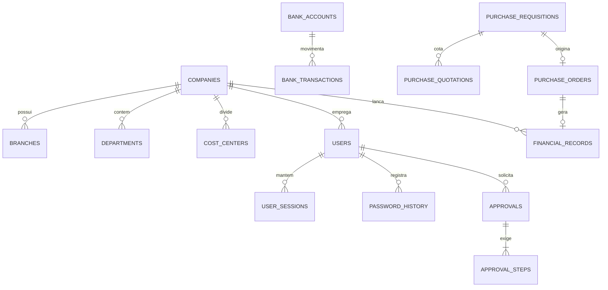

# SEEK MASTER TECHNICAL SPECIFICATION v1.0
## Especificação Técnica Mestre e Guia Arquitetural Corporativo

**Data de Emissão:** 06/10/2026  
**Versão da Especificação:** 1.0.0-ENTERPRISE  
**Plataforma Homologada em Produção:** [https://seek-xi.vercel.app](https://seek-xi.vercel.app)  
**Repositório Oficial:** [github.com/viniciuscasagrande-creator/SEEK](https://github.com/viniciuscasagrande-creator/SEEK)  
**Status dos Testes:** 92/92 Aprovados (Fase 0: 38 | Fase 1: 15 | Fase 2: 39 | Falhas: 0)

---

## 1. Princípio Fundamental e Fronteiras do Sistema

> [!IMPORTANT]
> **Fronteira Inviolável do SEEK Core:**  
> O SEEK é estritamente um **ERP & CRM Corporativo Interno de Retaguarda** (Enterprise Operating System). Funcionalidades de vendas públicas de ingressos, bilheteria B2C, catracas de acesso, portaria ou controle de público em tempo real **NÃO PERTENCEM** à base de código do SEEK Core. Qualquer integração com a vertical de eventos ou DiskIngressos ocorre estritamente via conectores externos, APIs versionadas (`/api/v1`) e webhooks.

### 1.1 Premissas Invioláveis de Desenvolvimento
1. **Retrocompatibilidade 100%:** Nenhuma tela existente, regra de negócio ou fallback para modo de demonstração estático pode ser quebrado.
2. **Navegação Fixa em 3 Níveis Congelada:** A sidebar desktop e gaveta mobile com menu fixo (Início, Gestão, Relacionamento, Estratégia, Administração) e submenus expansíveis em accordion não deve sofrer acréscimo de quartos ou quintos níveis na árvore lateral.
3. **Isolamento de Tenants:** Todas as transações e consultas devem respeitar a empresa (`company_id`) e a filial (`branch_id`) do usuário autenticado, salvo perfis com privilégio formal na Holding (`is_holding = 1`).
4. **Fechamento do Core Primeiro:** Nenhuma funcionalidade acessória pode ser implementada sem que a camada inferior do Core esteja 100% testada e homologada.

---

## 2. Matriz de Priorização Estratégica (P0 a P3)

```text
  ┌─────────────────────────────────────────────────────────────┐
  │                         SEEK AI (P3)                        │
  │     Agents • Copilot • Digital Twin • Forecast • Anomalias  │
  ├─────────────────────────────────────────────────────────────┤
  │                 SEEK PLATAFORMA & DADOS (P2)                │
  │    BI • Rules Engine • GED • Conectores • Process Mining    │
  ├─────────────────────────────────────────────────────────────┤
  │                 DOMÍNIOS DE NEGÓCIO ERP (P1)                │
  │ Financeiro • Contabilidade • Fiscal • Compras • Estoque • RH│
  ├─────────────────────────────────────────────────────────────┤
  │                       SEEK CORE (P0)                        │
  │ Identity • Tenants • RBAC/ABAC • SoD • Audit • DB Migrations │
  └─────────────────────────────────────────────────────────────┘
```

| Prioridade | Bloco Arquitetural | Escopo de Implementação | Status |
| :--- | :--- | :--- | :--- |
| **🔴 P0** | **Fundação do Core** | Autenticação real (JWT 15m + Refresh rotativo 7d), MFA/TOTP, RBAC/ABAC, SoD, LGPD Masking, Dual-Engine (SQLite WAL / PostgreSQL), Migrations versionadas, Transações atômicas, Repositories Pattern e Services Pattern. | **100% CONCLUÍDO (92 testes)** |
| **🟠 P1** | **Operação Empresarial** | Motor de Regras (*SEEK Rules*), Barramento de Eventos de Domínio (*Event Bus*), Partidas Dobradas contábeis, Fechamento de Competência (*Period Lock*), Liquidação bancária atômica, Compras com mapa de 3 fornecedores, Gestão de Freelancers/Taxas e CRM Comercial. | **EM ANDAMENTO** |
| **🟡 P2** | **Plataforma & SaaS** | Feature Flags (*Feature Management*), Billing & Subscription, Medição por consumo (*Metering*), Conector DiskIngressos / Settlement, Process Mining, Centro de Governança & Riscos, Incident Management e Observabilidade corporativa. | **PLANEJADO** |
| **🟢 P3** | **Inteligência & Futuro** | Agentes autônomos de IA (*SEEK AI Agents*), Simulação preditiva (*Digital Twin*), Centro de Treinamento (*SEEK Academy*), ESG e Torre de Controle (*Command Center*). | **FUTURO** |

---

## 3. Topologia Arquitetural e Estrutura de Diretórios

O SEEK adota o padrão **Modular Monolith** desacoplado em camadas formais:

```text
SEEK/
├── docs/                                  # Especificações arquiteturais e manuais
│   ├── SEEK_MASTER_TECHNICAL_SPECIFICATION_v1.0.md
│   ├── SEEK_MASTER_BLUEPRINT.md
│   ├── SEEK_V1_9_FASE_0_SEGURANCA_AUTENTICACAO.md
│   ├── SEEK_V1_9_FASE_1_POSTGRESQL_MIGRATIONS.md
│   └── SEEK_V1_9_FASE_2_SERVICES_REPOSITORIES.md
├── server/                                # Backend Node.js + Express + TypeScript
│   ├── migrations/                        # Scripts SQL versionados determinísticos (001 a 006+)
│   │   ├── 001_core_and_identity.sql
│   │   ├── 002_finance_and_control.sql
│   │   ├── 003_accounting_and_fiscal.sql
│   │   ├── 004_operations_and_crm.sql
│   │   ├── 005_hr_inventory_projects_governance.sql
│   │   └── 006_security_hardening_fase0.sql
│   ├── src/
│   │   ├── middleware/                    # Autenticação JWT, Sessões, RBAC, ABAC, Correlation ID
│   │   │   └── auth.ts
│   │   ├── repositories/                  # Camada de Acesso e Persistência de Dados (SQL isolado)
│   │   │   ├── user.repository.ts
│   │   │   ├── company.repository.ts
│   │   │   ├── finance.repository.ts
│   │   │   ├── workflow.repository.ts
│   │   │   └── purchasing.repository.ts
│   │   ├── services/                      # Camada de Domínio e Regras de Negócio
│   │   │   ├── auth.service.ts
│   │   │   ├── company.service.ts
│   │   │   ├── finance.service.ts
│   │   │   ├── workflow.service.ts
│   │   │   └── purchasing.service.ts
│   │   ├── routes/                        # Controladores HTTP REST da API v1
│   │   │   ├── auth.routes.ts
│   │   │   ├── core.routes.ts
│   │   │   ├── finance.routes.ts
│   │   │   ├── workflow.routes.ts
│   │   │   ├── purchasing.routes.ts
│   │   │   ├── accounting.routes.ts
│   │   │   ├── fiscal.routes.ts
│   │   │   ├── freelance.routes.ts
│   │   │   ├── hr.routes.ts
│   │   │   ├── crm.routes.ts
│   │   │   ├── contracts.routes.ts
│   │   │   ├── inventory.routes.ts
│   │   │   ├── projects.routes.ts
│   │   │   ├── serviceDesk.routes.ts
│   │   │   ├── governance.routes.ts
│   │   │   ├── documents.routes.ts
│   │   │   └── notifications.routes.ts
│   │   ├── utils/                         # Helpers de segurança, SoD, criptografia e LGPD
│   │   │   └── security.ts
│   │   ├── db.ts                          # Dual-engine SQLite WAL / PostgreSQL e transações
│   │   ├── migrate.ts                     # Executor de migrations idempotente
│   │   ├── server.ts                      # Ponto de entrada do backend API
│   │   ├── test_auth_fase0.ts             # Suíte de testes Fase 0 (38 testes)
│   │   ├── test_fase1_db.ts               # Suíte de testes Fase 1 (15 testes)
│   │   └── test_fase2_services.ts         # Suíte de testes Fase 2 (39 testes)
│   └── package.json
├── src/                                   # Frontend React 19 + TypeScript + Vite + Tailwind
│   ├── components/                        # Componentes globais (Sidebar, Header, Breadcrumb, Modais)
│   │   ├── Navigation.tsx
│   │   ├── Header.tsx
│   │   └── UI.tsx
│   ├── modules/                           # Telas dos 11 Módulos Oficiais
│   │   ├── FinanceModule.tsx
│   │   ├── AccountingModule.tsx
│   │   ├── FiscalModule.tsx
│   │   ├── PurchasingModule.tsx
│   │   ├── InventoryModule.tsx
│   │   ├── HRModule.tsx
│   │   ├── CRMModule.tsx
│   │   ├── ServiceDeskModule.tsx
│   │   ├── ProjectsModule.tsx
│   │   ├── GovernanceModule.tsx
│   │   └── AdminModule.tsx
│   ├── context/                           # Contextos globais (AuthContext, NavigationContext)
│   ├── types/                             # Tipagens TypeScript do Frontend
│   ├── App.tsx                            # Orquestrador com navegação e submenus accordion
│   └── main.tsx
└── package.json
```

---

## 4. Esquema de Dados Relacional e Entidades do Core

O banco de dados oficial opera em **PostgreSQL** em produção e **SQLite WAL** em ambiente local desacoplado, com esquema normalizado e idempotente:



### 4.1 Entidades de Identidade e Multi-Tenant
- **`companies`**: Cadastro mestre de empresas da holding (`is_holding = 1`).
- **`branches`**: Filiais operacionais com flag de sede (`is_headquarter = 1`).
- **`departments`**: Departamentos corporativos com teto orçamentário (`budget_limit`).
- **`cost_centers`**: Centros de custo estruturados (ex: `1.01.001`).
- **`users`**: Colaboradores com papel corporativo (`role_level`), alçada monetária (`approval_limit`), módulos autorizados e status MFA.
- **`user_sessions`**: Sessões ativas de login com hash do refresh token, IP, User Agent e revogação imediata (`is_revoked = 1`).
- **`password_history`**: Rastreabilidade dos hashes anteriores para impedir reutilização das últimas 3 senhas.

### 4.2 Entidades de Governança, SoD e Auditoria
- **`approvals`**: Solicitações multinível (compras, pagamentos, contratos).
- **`approval_steps`**: Passos sequenciais de alçada com nível exigido (`GESTOR`, `FINANCEIRO`, `DIRETORIA`) e histórico deliberativo.
- **`audit_logs`**: Log imutável estruturado com ação, módulo, entidade, usuário, IP e `correlation_id`.

### 4.3 Entidades Financeiras e Compras
- **`financial_records`**: Títulos a pagar (`CP-`) e a receber (`CR-`) com status (`PREVISTO`, `CONFIRMADO`, `PAGO`), centro de custo e chave de vínculo (`origin_type`, `origin_id`).
- **`bank_accounts`**: Contas corporativas e conciliação de saldos em tempo real.
- **`bank_transactions`**: Extrato bancário de débitos e créditos com vínculo de rastreabilidade.
- **`purchase_requisitions`**: Solicitações de compras com justificativa e centro de custo.
- **`purchase_quotations`**: Propostas de até 3 fornecedores para elaboração de matriz comparativa.
- **`purchase_orders`**: Pedidos de compra formais com aprovação auditada por SoD/ABAC.

---

## 5. Especificação dos 15 Componentes de Expansão Corporativa

Para suportar o crescimento do SEEK como ERP Enterprise e plataforma SaaS, os seguintes componentes foram integrados à especificação arquitetural:

### 1. 🧩 Feature Management (Feature Flags)
Habilitação granular de funcionalidades sem novo deploy, controlada por:
- Empresa / Tenant (`company_id`);
- Plano de contratação (`BASIC`, `PRO`, `ENTERPRISE`);
- Perfil de usuário (`role_level`);
- Ambiente (`staging`, `production`).

### 2. 💳 Billing & Subscription
Motor de faturamento do SEEK como SaaS corporativo:
- Planos base (número de filiais, módulos ativos);
- Licenciamento por usuário ativo;
- Ciclo de faturamento recorrente mensal/anual;
- Emissão automática de NFS-e e boletos via integração bancária.

### 3. 📈 Metering (Medição de Consumo)
Coleta de métricas operacionais para cobrança baseada em uso:
- Requisições de API por minuto/mês;
- Volume de documentos armazenados no GED (GB);
- Quantidade de transações financeiras liquidadas;
- Tokens consumidos em agentes de IA.

### 4. 🧪 QA & Quality Center (SEEK Quality)
Painel interno de governança de qualidade:
- Execução automatizada de testes de regressão (Fase 0, 1 e 2);
- Rastreamento de defeitos e bugs por severidade (Bloqueante, Crítico, Médio, Baixo);
- Critérios formais de homologação antes de promoção para produção.

### 5. 🚀 Release Management (SEEK Release Center)
Controle de versão e deploys auditados:
- Versionamento Semântico (`v1.9.0`, `v2.0.0`);
- Registro de Changelog executivo com evidências;
- Procedimento automatizado de rollback com integridade de banco;
- Validação dos gates de segurança antes de cada publicação.

### 6. 🧯 Incident Management (SEEK Incident)
Gestão de incidentes operacionais e de infraestrutura:
- Abertura automática de chamado em indisponibilidade de integração bancária ou gateway;
- Classificação por severidade (SEV-1 a SEV-4);
- Notificação escalonada de responsáveis (plantão / diretoria);
- Registro de causa raiz (*Post-Mortem*) e plano de ação.

### 7. 🔄 Business Continuity & Disaster Recovery
Camada de resiliência corporativa:
- Backup automatizado periódico com criptografia AES-256;
- Indicadores monitorados: **RTO** (Recovery Time Objective < 1 hora) e **RPO** (Recovery Point Objective < 15 minutos);
- Painel de status de replicação de banco de dados e failover.

### 8. 📜 Legal & Compliance (SEEK Compliance)
Central de conformidade normativa:
- Política de retenção de dados (*Data Retention*): dados ativos (5 anos), históricos, anonimizados e excluídos;
- Gestão de riscos corporativos com probabilidade e impacto;
- Controles internos de segregação de funções e prevenção a fraudes.

### 9. 🔐 Privacy Center (LGPD / Privacidade)
Gestão dos direitos dos titulares de dados:
- Registro de consentimento e finalidade de tratamento;
- Atendimento a solicitações de titulares (exportação, correção, anonimização e exclusão);
- Mascaramento dinâmico de dados sensíveis para operadores sem autorização formal.

### 10. 🗺️ Process Mining (Mineração de Processos)
Inteligência operacional sobre trilhas de auditoria:
- Mapeamento do tempo real de ciclo (lead time de compras, liquidação de pagamentos);
- Identificação de retrabalho (ex: requisições devolvidas para correção);
- Detecção de gargalos departamentais e violações de SLA.

### 11. 🎯 OKR & Gestão Estratégica (SEEK Strategy)
Desdobramento de metas executivas:
- Ciclos anuais e trimestrais de planejamento;
- Objetivos corporativos conectados aos KPIs reais do ERP (faturamento, EBITDA, prazos);
- Acompanhamento mensal de realizado vs. planejado com desvios percentuais.

### 12. 🏢 ESG (Governança, Social e Ambiental)
Indicadores corporativos para empresas de grande porte:
- Relatórios de governança e auditoria independente;
- Diversidade de quadro funcional e equidade salarial;
- Controle de fornecedores homologados segundo critérios éticos e trabalhistas.

### 13. 🌐 Localization Engine (Internacionalização)
Preparação estrutural para operação multimoeda e multinacional:
- Moeda base e moedas de transação (BRL, USD, EUR);
- Tabelas de conversão cambial com taxa histórica;
- Formatação localizada de datas, números e relatórios fiscais.

### 14. 🧠 Knowledge Center (SEEK Knowledge)
Base de conhecimento corporativa estruturada:
- Manuais de procedimentos operacionais padrão (POP);
- Políticas internas e regras deliberativas homologadas;
- Repositório documental vetorizado para subsidiar agentes de IA corporativos (*RAG*).

### 15. 🎓 SEEK Academy
Portal de capacitação e certificação interna:
- Trilhas de aprendizagem por função (Operador Financeiro, Comprador, Gestor de RH);
- Avaliações de proficiência nas ferramentas do ERP;
- Emissão de certificação interna de aptidão para operadores do sistema.

---

## 6. Visão de Futuro: SEEK Command Center & Digital Twin

### 6.1 SEEK Command Center (Torre de Controle Executiva)
Painel consolidado em tempo real para a Presidência e Diretoria:
- Indicadores financeiros consolidados (Receita líquida, EBITDA, saldo em tesouraria);
- Alertas preditivos de risco (inadimplência iminente, compras fora do teto, ruptura de estoque);
- Monitoramento de saúde das integrações e serviços críticos.

### 6.2 SEEK Digital Twin (Gêmeo Digital Corporativo)
Modelo de simulação preditiva alimentado por dados históricos do ERP:
- Simulação de cenários ("*What-if analysis*"): reajuste de preços, contratação de pessoal, antecipação de recebíveis;
- Projeção de impacto no fluxo de caixa e margem de contribuição antes da tomada de decisão.

---

## 7. Roteiro Sequencial de Implementação

1. **Fase 0 — Segurança, Autenticação Real, ABAC e SoD:** ✅ **CONCLUÍDO** (38 testes aprovados).
2. **Fase 1 — PostgreSQL, Dual-Engine e Migrations:** ✅ **CONCLUÍDO** (15 testes aprovados).
3. **Fase 2 — Repositories & Services Pattern, Multiempresa:** ✅ **CONCLUÍDO** (39 testes aprovados).
4. **Fase 3 (Próxima) — SEEK Rules Engine & Event Bus:** Motor de regras configuráveis de aprovação, alçadas e barramento de eventos de domínio desacoplados.
5. **Fase 4 — Contabilidade Avançada & Fechamento Contábil:** Livro Diário, Balancete, DRE em partidas dobradas e trava de período.
6. **Fase 5 — Conciliação Bancária Automatizada:** Leitura de extratos OFX/CNAB, batimento automático e resolução de divergências.
7. **Fase 6 — Feature Flags & Plataforma SaaS:** Gerenciamento dinâmico de recursos por tenant e plano.

---

## 8. Critérios de Aceite e Definition of Done (DoD)

Para cada nova entrega no SEEK ERP:
1. `server/src/test_*.ts` correspondente executado com **100% de aprovação e zero falhas**.
2. Compilação estrita do backend com `tsc` via `npm run server:build` finalizando com código de saída 0.
3. Compilação de produção do frontend via `npm run build` finalizando com código de saída 0.
4. Nenhuma regressão no menu fixo com submenus expansíveis nem nos 11 módulos existentes.
5. Todos os commits e registros de homologação associados ao endereço oficial:  
   👉 **`https://seek-xi.vercel.app`**
